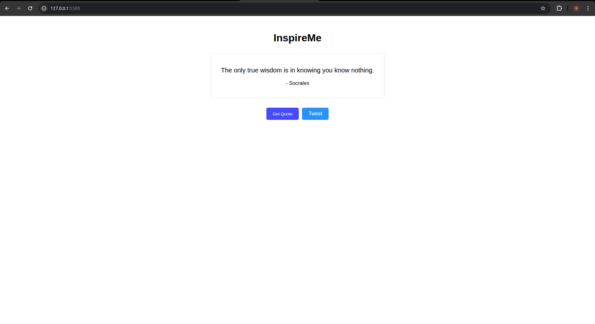
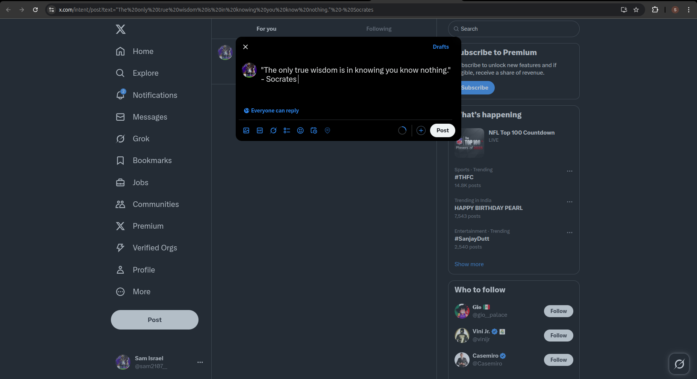

# Quote_Generator
## Date: 10/07/2025
## Objective:
To create a simple quote generator using HTML, CSS, and JavaScript that displays a new random motivational quote each time a button is clicked — similar to daily quote sections on blogs or productivity apps.

## Tasks:

#### 1. Create the HTML Structure:
Add a heading like ```<h1>InspireMe</h1>```

Use a ```<div> or <p>``` to display the quote text.

Use another ```<p> or <span>``` to display the author’s name.

Add a button labeled “Get Quote”.

#### 2. Style the Layout Using CSS:
Center everything on the page using flexbox.

Style the quote box with padding, background color, and rounded borders.

Use a clean font (like Roboto or Open Sans).

Add hover effects for the button.

#### 3. Add JavaScript Functionality:
Store an array of quotes (objects with text and author).

On button click, generate a random index using Math.random().

Display the selected quote and author in the HTML.

Ensure each click updates the quote dynamically using innerText.

#### 4. Enhancements:
Animate the quote change using fade effects.

Add a “Tweet this” button with a share link.
## HTML Code:
```html
<!DOCTYPE html>
<html>
<head>
    <title>InspireMe</title>
    <link rel="stylesheet" href="styles.css">
</head>
<body>
    <div class="container">
        <h1>InspireMe</h1>
        <div id="quote-box">
            <p id="quote">Click the button below</p>
            <p id="author"></p>
        </div>
        <div class="buttons">
            <button id="new-quote">Get Quote</button>
            <a id="tweet" target="_blank">Tweet</a>
        </div>
    </div>
    <script src="script.js"></script>
</body>
</html>
```
## CSS Code:
```css
body {
  font-family: Arial, sans-serif;
  text-align: center;
  margin-top: 50px;
}

#quote-box {
  margin: 30px auto;
  padding: 20px;
  max-width: 500px;
  border: 1px solid #ddd;
  border-radius: 5px;
}

#quote {
  font-size: 20px;
}

#author {
  font-style: italic;
  margin-top: 10px;
}

.buttons {
  display: flex;
  justify-content: center;
  gap: 10px;
}

button,
#tweet {
  padding: 10px 20px;
  background: #007bff;
  color: white;
  border: none;
  border-radius: 5px;
  cursor: pointer;
  text-decoration: none;
}

button:hover,
#tweet:hover {
  background: #0056b3;
}

#tweet {
  background: #1da1f2;
}

```
## JS Code
```js
const quotes = [
  {
    text: "Know thyself.",
    author: "Socrates",
  },
  {
    text: "The unexamined life is not worth living.",
    author: "Socrates",
  },
  {
    text: "We are what we repeatedly do. Excellence, then, is not an act, but a habit.",
    author: "Aristotle",
  },
  {
    text: "He who knows others is wise; he who knows himself is enlightened.",
    author: "Lao Tzu",
  },
  {
    text: "To find yourself, think for yourself.",
    author: "Socrates",
  },
  {
    text: "The only true wisdom is in knowing you know nothing.",
    author: "Socrates",
  },
  {
    text: "Your vision will become clear only when you can look into your own heart.",
    author: "Carl Jung",
  },
  {
    text: "Who looks outside, dreams; who looks inside, awakes.",
    author: "Carl Jung",
  },
  {
    text: "The self is not something ready-made, but something in continuous formation through choice of action.",
    author: "John Dewey",
  },
  {
    text: "The greatest explorer on this earth never takes voyages as long as those of the man who descends to the depth of his heart.",
    author: "Julien Green",
  },
];

function getQuote() {
  const random = Math.floor(Math.random() * quotes.length);
  const selectedQuote = quotes[random];
  document.getElementById("quote").textContent = selectedQuote.text;
  document.getElementById("author").textContent = "- " + selectedQuote.author;


  const tweetText = encodeURIComponent(
    `"${selectedQuote.text}" - ${selectedQuote.author}`
  );
  document.getElementById(
    "tweet"
  ).href = `https://twitter.com/intent/tweet?text=${tweetText}`;
}

document.getElementById("new-quote").addEventListener("click", getQuote);


getQuote();

```
## Output:


## Result:
A simple quote generator using HTML, CSS, and JavaScript that displays a new random motivational quote each time a button is clicked — similar to daily quote sections on blogs or productivity apps is created successfully.
